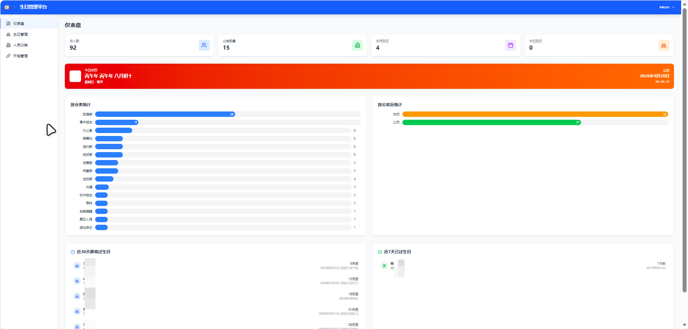
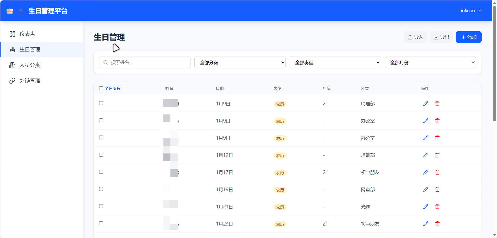
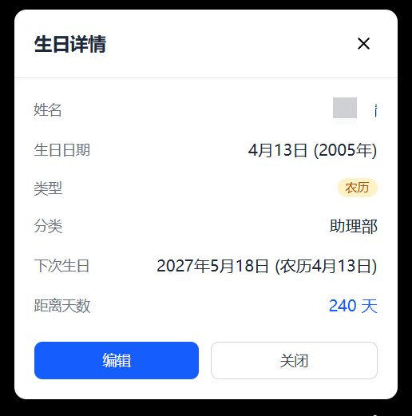
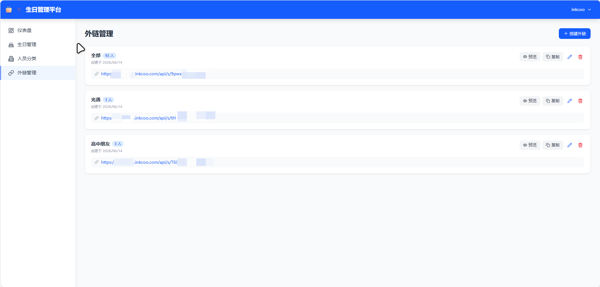
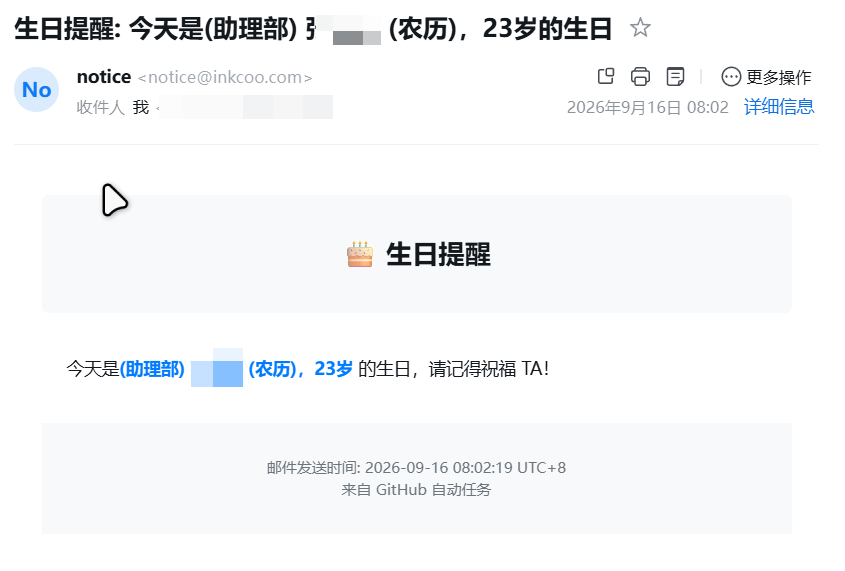

# 🎂 birthday-system（生日管理 + 自动邮件提醒）

> 一个仓库搞定两件事：**用网页管理生日** + **每天自动发 QQ 邮件提醒**。两者可独立使用，本文以"先用 txt 跑起来"为主线。

---

## 📸 平台预览

| 仪表盘 | 生日管理 |
|---|---|
|  |  |

| 生日详情 | 外链管理 |
|---|---|
|  |  |

| 邮件通知样例 |
|---|
|  |

---

## 一、项目简介

这是一个基于 **Python + GitHub Actions** 的生日自动提醒系统，配套一个 Vue 3 + Cloudflare 的可视化管理平台。

核心思路：你只需要准备一份生日数据（仓库根目录的 `birthdays.txt`，或在网页平台录入），GitHub Actions 每天早上 6:05 会自动跑 Python 脚本，检查"今天 / 明天"谁过生日，再通过 **QQ 邮箱**给你和可选的管理员发送一封 HTML 邮件提醒，从此不再错过任何一次祝福时刻。

支持 **公历（阳历）** 和 **农历（阴历，含闰月）**，每年农历日期自动换算，无需手动维护。

整套跑在 GitHub Actions 免费额度上，不需要自己租服务器。网页平台是可选的：想用可视化就部署，不想用直接编辑 `birthdays.txt` 也完全 OK。

---

## 二、项目动机

生日这种小事总是被工作、生活冲淡，等想起来的时候常常已经过去好几天 —— 特别是农历生日，每年公历对应的日期都不一样，光靠自己记根本记不住。给团队 / 社团 / 朋友群做这件事也存在同样的痛点。

于是做了这个项目，目的很朴素：

- **数据放进 `birthdays.txt`**，一行一人，所见即所得，新人也能秒上手；
- **每天定时跑一次**，没人过生日就安静地不打扰（不会发垃圾邮件）；
- **平台是可选的** —— 想用网页管理就部署，不想用就纯 txt，照样提醒；
- **整套跑在 GitHub Actions 免费额度上**，不需要自己租服务器。

最初是写给社团管理成员生日用的，后来扩展出网页平台方便跨端维护，再后来把两份代码合并到一个仓库，对外提供一套统一的数据格式。

---

## 三、作者介绍

| 项目 | 信息 |
|------|------|
| 作者 | koshoutou（Inkcoo） |
| 院校 | 湖南农业大学 |
| 方向 | 自学 AI 全栈开发，关注 AI 应用工程与 Web 产品设计 |
| 联系方式 | GitHub：@koshoutou |

---

## 四、技术栈

| 层级 | 技术 |
|------|------|
| **提醒后端（核心：定时跑、发邮件）** | **Python 3.11 + pytz + lunardate（跑在 GitHub Actions / Linux cron）** |
| 前端（管理平台，可选） | Vue 3 + Vue Router + Pinia + TailwindCSS 4 + Lucide Icons |
| 后端（管理平台，可选） | Hono（Cloudflare Pages Functions） |
| 数据库（管理平台） | Cloudflare D1（SQLite） |
| 农历数据 | 内置 1901–2100 全年数据（每年一个 JSON） |
| 邮件协议 | QQ 邮箱 SMTP（SSL 465） |
| 部署 | GitHub Actions（提醒）+ Cloudflare Pages（管理平台，可选） |
| 构建工具 | Vite 6 |

> **Python 才是真正的"后端"**：定时跑起来、查生日、发邮件，全靠 `reminder/birthday_reminder.py`。网页平台只是给数据做可视化维护，不参与邮件流程。
> 哪怕你完全跳过 `web/` 目录的部署，只要 Actions 跑通，整个项目就跑通。

---

## 五、功能特点

- 🎂 **生日提醒**：支持公历（阳历）和农历（阴历，含闰月），自动判断当天与次日。
- 📧 **QQ 邮件发送**：生日当天给本人（也是发件人）+ 可选管理员（**抄送**）发 HTML 邮件。
- ⏰ **明日预告**：提前一天知道明天有谁过生日，不再临期手忙脚乱。
- 🎈 **年龄显示**：带年份的条目自动算年龄（默认关闭，可用 `SHOW_AGE=1` 开启）。
- 🏷️ **分类管理**：网页平台按分类组织生日记录，导入时自动创建不存在的分类。
- 🔗 **外链分享**：网页平台可生成公开链接，按分类输出纯文本，配合 Python 脚本做"网页改数据 → 自动提醒"的闭环。
- 🧪 **演练模式**：`DRY_RUN=1` 只打印不发信，方便测试。
- 🌐 **多种数据源**：仓库内 txt / Secret URL / txt 首行链接三种方式，按优先级自动选择。
- 🧹 **日志与去重**：每天的执行结果、解析失败的行都会打印到 Actions 日志；重复条目自动跳过。
- 🛡️ **保活机制**：自带的 `Keep Repository Active` 工作流保证 GitHub 不会因为 60 天无提交而禁用定时任务。

---

## 六、5 分钟快速上手（小白版，推荐从这里开始）

> 这一节教你在自己的 **私人仓库** 里 5 分钟跑起来，整个过程不需要写一行代码。
> 用完后如果想要更方便的管理界面，再看第七节"进阶：部署 edit 平台"。

### 适用场景

- 🏢 企业行政部门管理员工生日
- 🎓 学校社团 / 学生会管理成员生日
- 👥 朋友圈 / 家庭群生日提醒
- 💼 团队管理者关怀成员
- 🧪 自己的私人日历辅助

### 第 1 步：Fork 本仓库

点本仓库右上角的 **Fork** 按钮，把代码 fork 到你自己的账号下。

**强烈建议设为私有仓库（Private）**，因为生日列表是隐私。

### 第 2 步：按格式填写 `birthdays.txt`

进入你 fork 后的仓库 → 打开根目录的 `birthdays.txt` → 点右上角铅笔图标 ✏️ 编辑。

每行一个人，用 `|` 分隔 4 段：

```
姓名 | 日期 | 类型 | 分类
```

| 字段 | 说明 | 示例 |
|------|------|------|
| 姓名 | 任意文字 | `张三` |
| 日期 | 带年份 `YYYY-MM-DD`，或无年份 `MM-DD`（带年份才会算年龄） | `1990-01-15` |
| 类型 | `SOLAR` = 公历 ｜ `LUNAR` = 农历 ｜ `LUNAR_LEAP` = 农历闰月 | `SOLAR` |
| 分类 | 没有就写 `未分类` | `运营部` |

示例（直接抄过去改也行）：

```
张三 | 1990-01-15 | SOLAR      | 运营部
李四 | 02-20      | LUNAR      | 助理部
王五 | 1985-03-10 | SOLAR      | 办公室
赵六 | 04-25      | LUNAR      | 网宣部
宋七 | 1995-05-30 | LUNAR_LEAP | 运营部
```

规则说明：

- `#` 开头的行是**注释**，会被忽略；空行也会忽略。
- 重复的条目自动去重，不会重复提醒。
- **农历闰月**用 `LUNAR_LEAP`：例如"闰五月初三"写 `LUNAR_LEAP | 05-03`，只在真正闰五月的那年才提醒。
- 农历生日**每年自动换算**，不用手动改日期。
- 兼容旧格式（`张三-1990-10-12-a-技术部`），老数据可直接用。

改完点 **Commit changes** 保存。

### 第 3 步：拿到 QQ 邮箱授权码

1. 用浏览器登录 [QQ 邮箱](https://mail.qq.com)
2. 顶部点 **设置** → 左侧选 **账户**
3. 往下找到 **POP3/IMAP/SMTP/Exchange/CardDAV/CalDAV服务**
4. 找到 **SMTP 服务** 这一行，点 **开启**
5. 按提示用绑定手机发短信验证，验证通过会显示一串 **16 位授权码**
6. 把这串授权码**复制保存好**（注意：这是授权码，**不是你的 QQ 密码**！）

### 第 4 步：配置仓库的 Secrets（邮箱环境变量）

进入你 fork 的仓库 → 顶部 **Settings** → 左侧 **Secrets and variables** → **Actions** → 右上 **New repository secret**，依次添加：

| Secret 名 | 必填 | 填什么 |
|-----------|------|--------|
| `SMTP_USER` | ✅ | 你的 QQ 邮箱地址，如 `123456@qq.com` |
| `SMTP_PASSWORD` | ✅ | 第 3 步拿到的 **16 位授权码**（不是 QQ 密码） |
| `ADMIN_EMAIL` | ❌ | 管理员邮箱，会**抄送**一份提醒（不填就不抄送） |
| `BIRTHDAYS_URL` | ❌ | 进阶用法：edit 平台外链（见第七节），极简用法**不用填** |

填完像这样：

```
SMTP_USER         = 123456@qq.com
SMTP_PASSWORD     = abcdefghijklmnop    ← 16 位授权码
ADMIN_EMAIL       = admin@qq.com        ← 可选
```

> 💡 这四个就是脚本需要的所有环境变量，对应 `reminder/birthday_reminder.py` 里的 SMTP/邮箱配置。

### 第 5 步：启用两个工作流

进入仓库的 **Actions** 标签：

1. 左侧列表点 **Birthday Reminder** → 右侧弹出 **Enable workflow** → 点启用
2. 同样左侧找到 **Keep Repository Active** → 右侧 **Enable workflow** → 点启用

接着回到 **Settings → Actions → General**：

- 找到 **Workflow permissions**
- 选 **Read and write permissions**
- 点 **Save**

> 保活工作流（Keep Repository Active）必须给写权限，因为它要做空提交来维持仓库活跃，避免被 GitHub 自动禁用定时任务。

### 第 6 步：手动演练一次（强烈推荐）

**Actions** → 左侧 **Birthday Reminder** → 右上 **Run workflow** → 勾上 `dry_run` → **Run workflow**。

等十几秒，点进这次运行记录往下翻，应该能看到：

```
[测试模式] 指定日期：2026-01-15
============================================================
读取生日数据…
数据源：本地文件：...
成功解析：15 条
============================================================

今日生日（1 位）：
  张三 | 1990-01-15 | SOLAR | 运营部
```

看到 `今日生日（N 位）` 就说明配置成功，不会真发邮件。

### 第 7 步：开启真实邮件

再点一次 **Run workflow**，这次**不勾** `dry_run`。几分钟后你应该在 QQ 邮箱（以及管理员邮箱，如果有）收到提醒邮件。

之后每天 **北京时间早上 6:05** 自动跑一次。想改时间见第九节。

🎉 至此整套系统就跑起来了，不需要写一行代码、不需要租服务器。

---

## 七、进阶：部署 edit 平台（可选）

如果想用网页增删改生日、按分类管理、出外链给其他人看，再部署 `web/` 平台。**不部署也不影响邮件提醒**。

### 1. 部署平台到 Cloudflare Pages

```bash
cd web
npm install
npx wrangler login                              # 登录 Cloudflare 账号
npx wrangler d1 create birthday-edit-db         # 建数据库，把输出的 id 填进 wrangler.toml
npx wrangler d1 execute birthday-edit-db --remote --file functions/db/schema.sql
npm run build
npx wrangler pages deploy dist --project-name=birthday-edit --branch=main
```

> ⚠️ 部署前**必须**做两件事：
> 1. 把 `wrangler.toml` 里的 `JWT_SECRET` 改成你自己的随机字符串（用 `openssl rand -hex 32` 生成）
> 2. 创建管理员账号（schema.sql 不再内置默认账号），详见下方

### 2. 创建第一个管理员账号

仓库不内置任何默认账号，避免公开部署时被恶意登录。建表完成后，自己手动创建：

```bash
# 1. 生成密码的 SHA-256（把 your-password 改成你自己的密码）
python3 -c "import hashlib; print(hashlib.sha256('your-password'.encode()).hexdigest())"
# 把输出复制下来

# 2. 用 wrangler 把管理员账号插入 D1
npx wrangler d1 execute birthday-edit-db --remote \
  --command "INSERT INTO users (username, password_hash) VALUES ('admin', '刚才复制的哈希值');"
```

之后浏览器打开平台，用 `admin` + 你设的密码登录即可。

> 平台里「用户菜单 → 修改密码」可以随时换密码（注意旧密码也走 SHA-256 校验，不要忘记）。

### 3. 拿外链

进入平台后，左侧「外链管理」→ 新建一个外链，复制地址，形如：

```
https://<你的部署域名>/api/s/<token>
```

浏览器打开它，能看到**纯文本**，每行就是上面那套 4 段格式。

### 3. 让脚本读这个链接（两种方式任选）

**方式 A：把链接写进 `birthdays.txt` 第一行**（推荐，改起来最直观）

```
# 下面这一行是 edit 平台外链，脚本会自动去抓取
https://<你的部署域名>/api/s/<token>
```

> ⚠️ 一旦第一行是链接，文件里**其余的生日行会被忽略**，全部以链接内容为准。

**方式 B：填到 Secret**

- GitHub Actions：添加 Secret `BIRTHDAYS_URL` = 外链地址
- 本地运行：在 `email.env` 里写 `BIRTHDAYS_URL=https://...`

### 数据源优先级

| 优先级 | 条件 | 用哪个数据 |
|--------|------|-----------|
| 1 | 设置了 `BIRTHDAYS_URL` | 抓这个链接 |
| 2 | `birthdays.txt` 第一行是 `http(s)://` 链接 | 抓这个链接 |
| 3 | 其他情况 | 用 `birthdays.txt` 本地内容（**默认**） |

链接抓不到时会自动报错并回退到本地内容，不会让任务直接挂掉。

---

## 八、所有可配置项（环境变量）

在 Actions Secrets 或本地 `email.env` 里设置：

| 变量 | 默认 | 说明 |
|------|------|------|
| `SMTP_USER` | 无（**必填**） | QQ 邮箱地址，也是收件人 |
| `SMTP_PASSWORD` | 无（**必填**） | QQ 邮箱 **SMTP 授权码**（16 位，不是 QQ 密码） |
| `ADMIN_EMAIL` | 空 | 管理员邮箱，抄送提醒 |
| `BIRTHDAYS_URL` | 空 | edit 平台外链，留空则用本地 txt |
| `TOMORROW_NOTICE` | `1` | 是否附带"明日生日预告"，`0` 关闭 |
| `ALWAYS_SEND` | `0` | 没人过生日时是否也发邮件，`1` 开启 |
| `SHOW_AGE` | `0` | 邮件里多加一列年龄，`1` 开启 |
| `DRY_RUN` | `0` | `1` = 只演练不发信，用来测试配置 |
| `TODAY_OVERRIDE` | 空 | 调试用，如 `2025-07-25` 假装今天是这天 |
| `SMTP_SERVER` | `smtp.qq.com` | 换其他邮箱时才改 |
| `SMTP_PORT` | `465` | 换其他邮箱时才改 |

---

## 九、常见修改 & 排错

**改提醒时间**：编辑 `.github/workflows/birthday_reminder.yml` 的 cron。GitHub 用 **UTC** 时间，北京时间减 8 小时：

```yaml
- cron: '05 22 * * *'   # 22:05 UTC = 北京时间次日 06:05
- cron: '00 23 * * *'   # 改成这个就是北京时间早上 7:00
```

**邮件收不到？** 按顺序排查：

1. `SMTP_PASSWORD` 填的是**授权码**而不是 QQ 密码（最常见，9 成问题出在这里）
2. QQ 邮箱的 SMTP 服务确实已开启
3. 去 Actions 运行日志里看有没有「邮件发送失败」
4. 邮件可能在垃圾箱里
5. 在 Actions 里用 `TODAY_OVERRIDE` 环境变量临时模拟某天做测试

**想同时提醒多个人？** 直接在 `birthdays.txt` 里加行就行，同一天多个人会在一封邮件里列出。

**保活工作流是什么？** GitHub 会自动禁用 60 天没提交过的仓库的定时任务。`Keep Repository Active` 工作流每月 1 号和 16 号检查一次，距上次提交超过 20 天就打一次空提交，保证提醒任务一直能跑。

**手动测试指定日期**（不需要等那一天）：

```bash
TODAY_OVERRIDE=2026-01-31 DRY_RUN=1 python3 reminder/birthday_reminder.py
```

---

## 十、本地运行（不用 GitHub 也行）

```bash
# 安装依赖
pip3 install -r reminder/requirements.txt
```

在仓库根目录建一个 `email.env`：

```ini
SMTP_USER=123456@qq.com
SMTP_PASSWORD=你的16位授权码
ADMIN_EMAIL=admin@qq.com
```

跑起来：

```bash
# 真发邮件
python3 reminder/birthday_reminder.py

# 只演练不发送
DRY_RUN=1 python3 reminder/birthday_reminder.py

# 指定日期测试（调试用）
TODAY_OVERRIDE=2026-01-31 DRY_RUN=1 python3 reminder/birthday_reminder.py
```

服务器定时任务（每天早 8 点）：

```bash
# 编辑 crontab
crontab -e

# 加入这一行（路径改成你自己的项目目录）
0 8 * * * cd /path/to/birthday-system && python3 reminder/birthday_reminder.py >> birthday.log 2>&1
```

如需保存运行日志调试，可以把输出重定向到 `birthday.log`：

```bash
0 8 * * * cd /path/to/birthday-system && python3 reminder/birthday_reminder.py >> birthday.log 2>&1
```

---

## 十一、邮件长什么样

```
🎂 今日2位生日：李四、王五

🎂 今日生日（2 位）
  李四 | 02-20 | LUNAR | 助理部
  王五 | 1985-03-10 | SOLAR | 办公室

⏰ 明日预告（1 位）
  张三 | 11-15 | SOLAR | 助理部
```

（原「部门」字段已统一改为「分类」，与 edit 平台一致。）

---

## 十二、许可证

本项目采用 **[GPL-3.0](https://www.gnu.org/licenses/gpl-3.0.en.html#license-text)** 许可证。你可以免费使用、修改和分发本项目的代码，但必须遵守 GPL-3.0 的许可证条款。

如需商业许可，请联系作者。

---

## 十三、更新日志

### 2026.9.20 — 合并 `birthday-edit` 网页平台 + `birthdays_reminder
` Python 提醒脚本

- 统一数据格式为 `姓名 | 日期 | SOLAR/LUNAR/LUNAR_LEAP | 分类`
- 重写 Python 脚本：QQ 邮箱 + 闰月修正 + 明日预告 + 三级数据源 + 去重
- 重写 GitHub Actions 工作流（含按天保活）
- 重新设计 edit 平台的输出与解析，两边协议统一
- 完整重写 README，从小白视角手把手教起

### 2026.02.16 — birthdays_edit - 新增生日记录管理平台输出birthdays.txt文本

### 2025.09.07 — birthdays_reminder

- 新增部门显示功能和修复年龄计算功能
- 优化本地部署方案介绍
- 改进邮件格式为 HTML

### 2025.09.04 — birthdays_reminder

- 新增年龄判断和显示功能，重复行跳过

### 2025.08.04 — birthdays_reminder

- 新增工作流保活配置文件，避免 60 天仓库无提交导致工作流禁用
- 修复 GitHub Actions 控制台返回报错问题

### 2024.10.17 — birthdays_reminder

- 修改农历时间及生日判断改为用北京时间判断，避免 GitHub 运行时区影响

### 2024.10.12 — 初版 birthdays_reminder
